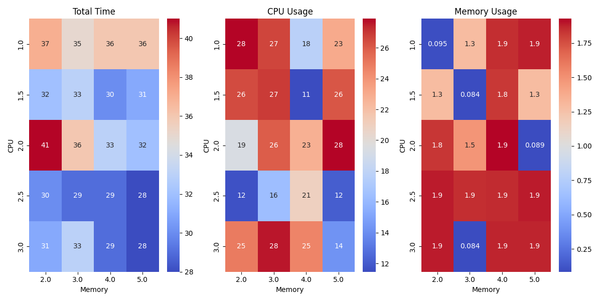
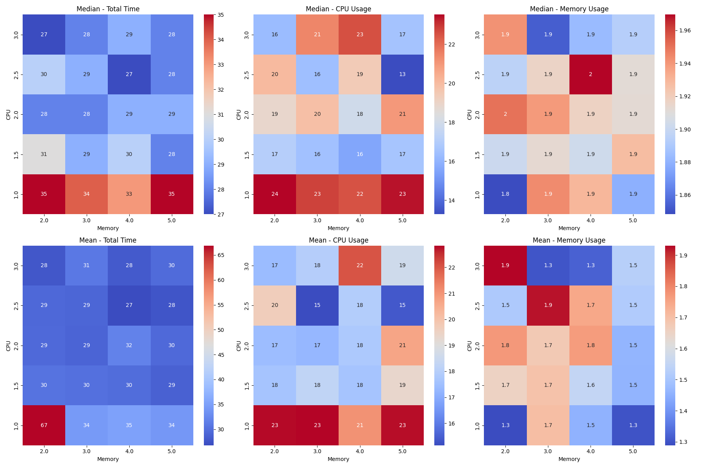

# ML Model Training Benchmarking

## Overview

This experiment focused on benchmarking the performance of training a digit recognition model using the MNIST database. The primary objective was to identify patterns and potential optimizations for future model training by analyzing metrics.

## Methodology

The experiment was designed to test the model on Kubernetes (K8S), independent of the underlying platform. However, only Docker and KVM platforms were utilized for this testing. Various configurations of memory and CPU resources were applied to train the model in these environments.

The selected performance metrics are `total training time`, `total memory usage`, `total CPU usage`, and `model accuracy`.

A significant challenge encountered was the collection of metrics from Kubernetes. To address this, Prometheus was used for metric collection, following the documented and recommended approach for Kubernetes. An [additional deployment](../../../manifests/overlays/local/prometheus) within the cluster was set up to run Prometheus for this purpose.

Performance metrics were collected and recorded in a JSON file. And a heatmap is generated to visualize how a certain metric behaves when varying the input configuration (memory and CPU).

To replicate the benchmarking environment, just run `setup.sh`. The tools needed to run the project as documented in the root of the repo, are supposed to be met. After that `cd 01-basic` and run `pnpm start`. After the results are generated, move them in `results` directory so that you can generate a heatmap to visualize them using `venv/bin/python plot.py`.

### Results

During the initial tests, containers with less than 2GB of memory consistently failed due to insufficient memory.
This issue was also observed in Docker containers outside of Kubernetes, which required at least 1GB of memory to run successfully.
Initial testing on Docker also revealed that model accuracy did not change significantly, leading to its removal from further tests.

The benchmark results presented below are based on testing a Kubernetes (K8S) cluster on KVM.
It was noted that K8S on KVM offered greater stability compared to K8S on Docker, where containers occasionally failed without clear reasons.
As a result, K8S on KVM was preferred for its reliability, and the results from this setup were used to avoid complications with missing values.

The initial heatmap, shown below, demonstrated some unexpected values due to measurement errors.

To address these anomalies and improve the accuracy of the analysis, multiple trials were conducted.
Data from these trials were combined by calculating the median and mean of the values, resulting in a more reliable heatmap.

### Conclusions and Findings

The benchmarking results, whether conducted on Kubernetes (K8S) on KVM or K8S on Docker or Docker directly, displayed inconsistencies.

The benchmarking results were obtained from local tests, which leads to two possible hypotheses.
The first hypothesis is that CPU and memory resources might not significantly influence the training of the model, which could explain the observed inconsistencies in results.
The second hypothesis is that using dedicated servers for model training could lead to more consistent and significant differences.

Regardless of which hypothesis is correct, the results provide valuable insights.
Specifically, the data indicates that increasing memory beyond a certain point may not substantially impact training performance. However, increasing the number of CPU cores generally reduces training time, which is beneficial for optimizing training efficiency. Additionally, it is evident that a minimum of 2GB of memory is required to successfully train the model.

### Future Work

The initial approach provided valuable insights, but several areas could be explored further. Future work will include trying other datasets and algorithms to compare results and gain a more comprehensive understanding of performance factors. Federated learning is another area of interest, as it aligns well with Kubernetes’ capabilities for orchestrating multiple containers and could offer additional optimization opportunities.

One ongoing challenge is the collection of accurate metrics. The current method, using Prometheus, might not fully capture the true performance of containers in Kubernetes. Exploring alternative approaches or improvements in metric collection could provide more precise insights. Identifying and implementing better ways to obtain and analyze these metrics remains a priority to ensure that the results reflect the actual performance of the containers in the K8S environment.
